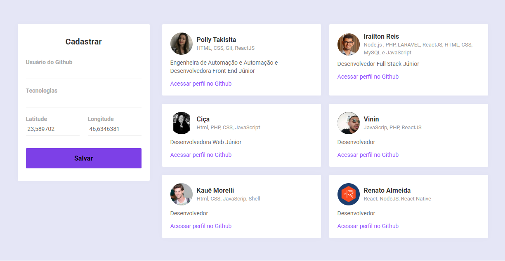

<h1 align="center">Front-end Cadastra Devs 👋</h1>
<p>
  
</p>

## Install

```sh
npm install
```

## Usage

```sh
npm run start
```

## Frontend - Interfaces

### 1. Cadastra Devs



**Poliana**  ⭐️

* LinkedIn: [@polianatakisita](https://www.linkedin.com/in/polianatakisita)

## 📝 License
Copyright © 2020 [poliana](https://github.com/pollytakisita).<br />
This project is [MIT](https://github.com/pollytakisita/Frontend---Interface/licence) licensed.


***
_This README was generated with ❤️ by [readme-md-generator](https://github.com/kefranabg/readme-md-generator)_